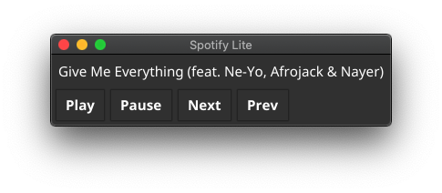

### Spotify Lite (Go Lang)
Simple Spotify Client built in go lang and [fyne](http://fyne.io)

[](https://github.com/barelyhuman/commitlog)


## Disclaimer
This repo / app has nothing to with the Official Spotify clients. 
This is an unofficial client with a GUI for existing connected remote spotify devices.


### Scope
This app doesn't act as a replacement to the desktop client of Spotify since there is no way for me to play the actual audio right now.
(If there is, let me know via a Pull Request of mail me the resources that you think would help)

Instead,
This was built with my personal use case in mind where you have a burner/old smartphone connected to spotify and a bluetooth Speaker.

If I wanted to change a track I either have to walk to the device which is normally on the other end of the room or open spotify on my mac book and the webpage takes up 300-500mb worth of memory and that's not something my RAM can afford with other dev tools running on it. 

The app will add on other features but unless spotify releases a desktop player sdk, I doubt I'll be making this app any more complex than it needs to be.

### Alteratives ?
- There's a plugin/add-on on VS Code called Music Time that can be used to provide similar functionality but uses the install spotify to work (again, Both being RAM hungry)

#### TLDR;
This tools is a lite remote control for an already active device playing a playlist on spotify.


#### Features 
- Control Spotify Playback

### Roadmap 
At this point, the primary goal is to have a working client that can change the current track in the playlist and play pause when needed.
Additional Features would include

- Searching and playlist, showing current playlist
- Playlists (Add, Remove, Add to, Remove from, Play selected)
- Start Radio of current playing song 
- Change to one of connected devices.

### Usage / Installation / Builds 

Beta Release Available - [Releases](https://github.com/barelyhuman/spotify-lite-go/releases)

Project under dev, builds will be on the releases page once done.


### Screenshot




### Manual / Dev 

```sh
go get github.com/barelyhuman/spotify-lite-go
```

Run
```sh
go run main.go
```

Build
```sh
go get fyne.io/fyne/cmd/fyne
fyne package -os darwin -name "Spotify Lite"
```
